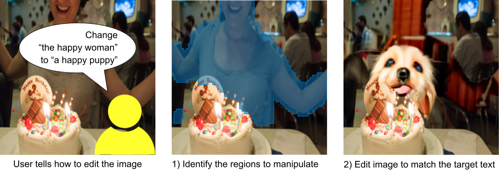
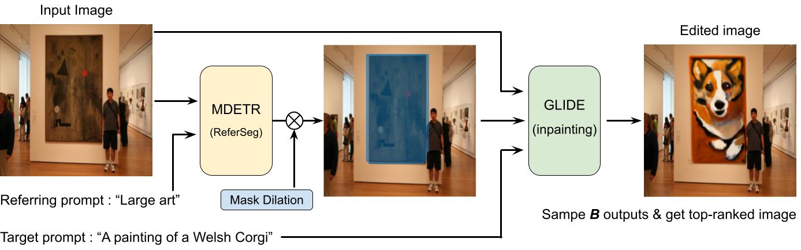

# Referring Object Manipulation

[[Paper(TBU)]](https://myungsub.github.io/)
[[Project]](https://myungsub.github.io/)


This is the authors' code release for:
> **Referring Object Manipulation of Natural Images using Conditional Classifier-free Guidance**
> Myungsub Choi



*Disclaimer: This is not an officially supported Google product.*


## Setup

1. Clone this repository:
    ```bash
    git clone https://github.com/google/referring-manipulation.git
    ```

1. Install a Conda environment with all dependencies:
    ```bash
    cd referring-manipulation
    conda env create -f environment.yml
    conda activate referman
    ```

Tips:
* You can find the PyTorch, cuDNN, and CUDA versions in `environment.yml`.


## Running the Code

Run the main script: `./run.sh`

You can find the sample inference options in `run.sh` and the full options list in `third_party/blended_diffusion/optimization/arguments.py`.

To test with your own examples, change `refer_prompt`, `target_prompt`, and the
`input_image` in `run.sh`. The output files will be saved in `output_path`.

The main part of the code lies in `image_editor_glide.py`. Please check `edit_image_by_prompt` function where the referring segmentation and image editing is performed sequentially.




## Issues or Questions?

If the issue is code-related, please open an issue here.

For questions, please also consider opening an issue as it may benefit future
reader. Otherwise, email [Myungsub Choi](https://myungsub.github.io).


## Acknowledgments

This repository builds upon
[the MDETR referring image segmentation repository](https://github.com/ashkamath/mdetr),
[the GLIDE repository](https://github.com/openai/glide-text2im), and
[the Blended-Diffusion repository](https://github.com/omriav/blended-diffusion).
We thank the authors for making their code publicly available.


## Changelog

* 04/22/2022: Initial release.
